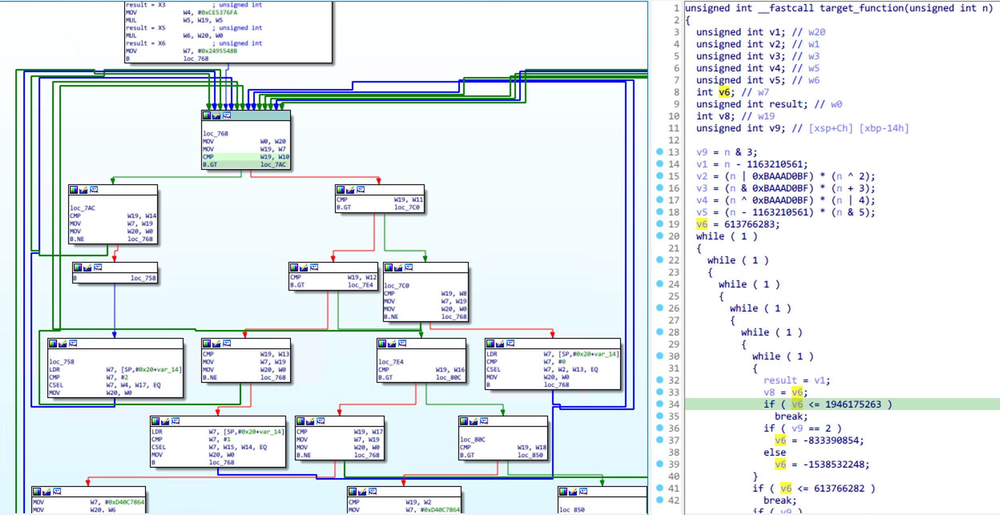

# Obfuscated Binary Pseudocode Optimizer

[中文说明](https://mp.weixin.qq.com/s/ZA-Pt7WnEhGXlFSi5hJrcw) | [在线交流 | Gitter Community](https://gitter.im/obpoplugin/community?utm_source=badge&utm_medium=badge&utm_campaign=pr-badge)

Obpo is a microcode-based hex-rays optimizer, uses techniques such as static-program-analysis, dataflow-tracking,
concolic-execution to rebuild the obfuscated control flow (such as: OLLVM).

## obpo-plugin

Obpo is not open source yet, but currently provides obpo-plugin for testing. obpo-plugin is a cloud plugin, the binary
code of the target function will be sent to the obpo server for processing, and the response result will be applied to
the decompilation process.

### NOTE

1. Obpo can't solve all obfuscate problems, but I hope it can be a powerful option.
2. Due to the limited server performance, the timeout is limited to 60s. If there is abuse or attack behavior, I will
   close the service at any time.

## Supported Version

obpo-plugin currently requires the following versions of hex-rays decompiler:

| Hex-Rays Version | Arch                     | Tested |
| ---------------- | ------------------------ | ------ |
| 7.7.0.220118     | ARM64, X86, X86_64       | ✔️   |
| 7.6.0.210427     | ARM, ARM64, X86, X86_64  | ✔️   |
| 7.6.0.210427     | PowerPC, PowerPC64, MIPS | ❌️   |
| 7.5.0.201028     | ARM, ARM64, X86, X86_64  | ✔️   |
| 7.5.0.201028     | PowerPC, PowerPC64, MIPS | ❌️   |

## Installation

Copy `obpo_plugin.py` and `obpoplugin` into ida plugins path.

## Usages

Obpo requires you to manually mark a dispatch block for Control Flow Flattening before automated analysis. Normally, the
dispatch block looks like this:

Right-click on the control flow graph, click `OBPO -> Mark and process function`. Refresh the decompiler after
processing is complete, like this:

Depending on the decompilation changes you can continue to mark dispatch blocks.

## Samples

In the [samples](samples) directory, saved some pseudocode and compare image by automation testing.

### Feedback

All sample binaries are saved in [obpo-project/samples](https://github.com/obpo-project/samples). Welcome to submit
other sample.
